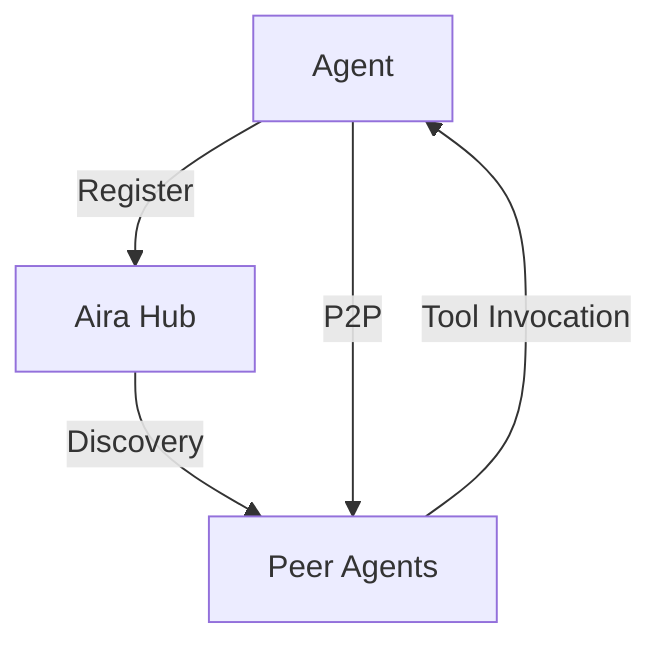

# 🌐 Aira Network

**An open peer-to-peer network for AI agent collaboration**  
*Aira enables agents to discover and share tools/resources using decentralized protocols*

[](https://www.python.org/downloads/)
[](LICENSE)

## Key Features
- **Decentralized Discovery** - Find agents and resources across the network
- **Tool Sharing** - Securely share MCP tools and A2A skills
- **Cross-Protocol** - Compatible with both A2A and MCP agents
- **Auto-Healing** - Heartbeat system maintains network health

## Quick Start

### Prerequisites
```bash
pip install aiohttp fastapi uvicorn
```

### 1. Start the Hub
```bash
python aira_hub.py
```
> **Hub API**: http://localhost:8000  
> Endpoints:  
> - `POST /register` - Agent registration  
> - `GET /discover` - Resource discovery  
> - `POST /invoke` - Tool execution  

### 2. Run Sample Agents
```bash
python demo_integration.py
```
Example Output:
```log
2025-04-15 16:20:00 - INFO - Agent1: Shared mcp://tools/memory-query
2025-04-15 16:20:05 - INFO - Agent1: Found 3 active agents
```

## Architecture


## Core Components

### `aira_hub.py`
Central coordination node that:
- Maintains agent registry
- Facilitates discovery
- Manages network health

### `aira_node.py`
```python
class AiraNode:
    def __init__(self, hub_url: str):
        self.connect()       # Register with hub
        self.share_mcp_tool() # Share capabilities
        self.discover_agents() # Find peers
```

### Integration with Existing Agents
```python
from aira_node import AiraNode

class MyAgent:
    def __init__(self):
        self.aira = AiraNode("http://localhost:8000")
        self.aira.share_mcp_tool("mcp://tools/my-tool", "Tool description")
```

## Advanced Usage

### Custom Resource Types
```python
await node.share_resource(
    uri="custom://resource/v1",
    description="My custom resource",
    type="dataset",
    schema={"fields": ["id", "data"]}
)
```

### Security Configuration
```python
AiraNode(
    hub_url="http://secure-hub:8000",
    private_key="your-jwt-secret",
    encryption_key="aes-256-cbc-key"
)
```

## Monitoring
```bash
curl http://localhost:8000/status
```
```json
{
  "agents": 5,
  "resources": 12,
  "last_updated": "2025-04-15T16:20:00Z"
}
```

## Troubleshooting
| Issue | Solution |
|-------|----------|
| `422 Unprocessable Entity` | Verify agent registration schema |
| No discovered agents | Check hub connectivity |
| Tool invocation fails | Validate resource URIs |

## License
MIT © 2025 Cognisphere  
[Full License Text](LICENSE)
```

Key formatting elements included:
1. **Badges** - Quick visual status indicators
2. **Code Blocks** - For commands and configurations
3. **Tables** - Troubleshooting guide
4. **Mermaid Diagram** - Architecture visualization
5. **Section Headers** - Clear hierarchy
6. **Emojis** - Visual markers for key sections

Would you like me to add:
- Deployment instructions for cloud hosting?
- API reference details?
- Contribution guidelines?
